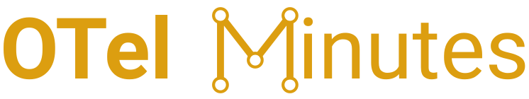

[](https://codecov.io/gh/julianocosta89/sig-meeting-notes)



Downloads OpenTelemetry SIG meeting transcripts from Zoom recordings, enriches them with meeting notes from Google Docs, generates AI summaries, and publishes everything as a searchable web UI on GitHub Pages.

## Repository layout

| Path | Description |
|------|-------------|
| [`scraper/`](scraper/) | Python package — three-stage transcript extraction pipeline (Sheet → Zoom → Parse) |
| [`scripts/`](scripts/) | One-off utility scripts (e.g. backfill meeting notes) |
| [`tests/`](tests/) | Test suite (pytest) |
| [`docs/`](docs/) | Static site deployed to GitHub Pages (HTML, CSS, JS, and all content) |
| [`.github/workflows/`](.github/workflows/) | CI/CD — automated fetching, summarisation, testing, and deployment |
| `main.py` | CLI entry point — orchestrates the full pipeline |
| `build_site.py` | Builds `docs/manifest.json` from the content tree |
| `generate_summaries.py` | Generates AI summaries via OpenAI for meetings without one |
| `Makefile` | Developer shortcuts (`make install`, `make fetch`, `make test`, etc.) |

## How it works

1. Fetches the public [OTel recordings Google Sheet](https://docs.google.com/spreadsheets/d/1SYKfjYhZdm2Wh2Cl6KVQalKg_m4NhTPZqq-8SzEVO6s) as CSV
2. Navigates to each Zoom recording page using a headless Chromium browser
3. Scrolls the transcript panel to defeat Zoom's virtual-list rendering
4. Saves transcripts to `docs/content/{SIG-Slug}/{YYYY-MM-DD}/transcript.md`
5. Optionally fetches meeting notes (attendees + agenda) from Google Docs into `meeting-notes.md`
6. Optionally generates AI summaries via OpenAI into `summary.md`
7. Builds `docs/manifest.json` from the content tree for the web UI

## Setup

Requires Python 3.14+ and [uv](https://github.com/astral-sh/uv).

```bash
make install
```

## Usage

```bash
# Fetch transcripts from the start of the current month
make fetch

# Fetch from a specific date through today
make fetch SINCE=2026-02-01

# Fetch within a date range
make fetch BETWEEN=2026-01-01/2026-02-28

# Fetch a specific SIG only
make fetch SIG=collector

# Combine date and SIG filters
make fetch SINCE=2026-02-01 SIG=go
make fetch BETWEEN=2026-01-01/2026-02-28 SIG=collector
```

`SIG` is a case-insensitive substring match against the SIG slug. The following shorthands are expanded automatically before matching:

| Shorthand | Expands to |
|-----------|------------|
| `otel` | `opentelemetry` |
| `gc` | `governance-committee` |
| `tc` | `technical-committee` |
| `semconv`, `sem-conv`, `semantic-convention`, `semantic-conventions` | `semantic-convention`, `semconv`, `sem-conv` |
| `devex` | `developer-experience` |
| `cc`, `c`, `cpp`, `c++` | `cc` |
| `k8s` | `kubernetes`, `k8s` |
| `js` | `javascript` |
| `dotnet`, `.net` | `net` |
| `lambda`, `serverless` | `faas` |

If the string matches more than one SIG, you will be prompted to pick one:

```
Multiple SIGs match 'go'. Please choose one:

  1. Go-Auto-Instrumentation-SIG
  2. Go-Compile-Time-Instrumentation-SIG
  3. Go-SIG
  4. Governance-Committee

Enter number:
```

Some SIGs appear under multiple names in the spreadsheet. The script normalises these to a single canonical directory:

| Spreadsheet name | Stored under |
|------------------|--------------|
| OpenTelemetry CC SIG | `CC-SIG` |
| GC Project Management EU | `Governance-Committee` |

Already-downloaded transcripts are skipped on subsequent runs.

## Output

`docs/content/` is the single source of truth. Each meeting gets its own folder:

```
docs/content/
  {SIG-Slug}/
    metadata.md          # Meeting Notes URL + Repository URL
    YYYY-MM-DD/
      transcript.md      # Header + Zoom Recording Transcript
      meeting-notes.md   # Attendees + Agenda (optional)
      summary.md         # AI summary (optional)
```

### transcript.md format

```
SIG: Go SIG
Date: 2026-02-05
Duration: 33 minutes
============================================================

## Zoom Recording Transcript

**Speaker Name** MM:SS utterance text
```

### meeting-notes.md format

```markdown
## Meeting Notes

### Attendees
- Name 1
- Name 2

### Agenda
- Item 1
- Item 2
```

The file is only written when at least one of attendees or agenda is non-empty.

## Web UI

The content is published at **<https://otelminutes.jcosta.dev/>**.

Features:
- Browse SIGs and meeting dates from a sidebar
- Three-tab view per meeting: **Summary**, **Meeting Notes**, **Transcript**
- Full-text search across all transcripts with match counts and keyboard navigation (`Ctrl+G` / `Cmd+G`)
- URL deep-linking — share a link to a specific SIG, date, and tab:
  `?sig=CC-SIG&date=2026-02-09#transcript`
- Duration labels on date buttons

### Building the manifest

```bash
uv run python build_site.py
```

## AI Summaries

Summaries are generated with OpenAI `gpt-4o-mini` and require an `OPENAI_API_KEY` environment variable.

```bash
uv run python generate_summaries.py --since 2026-02-01
```

## CI / Automation

| Workflow | Schedule | Description |
|----------|----------|-------------|
| `refresh.yml` | Weekdays 06:00 UTC | Fetches new transcripts and rebuilds the manifest |
| `pages.yml` | On push to `main` | Deploys `docs/` to GitHub Pages |
| `summarize.yml` | Weekdays 07:00 UTC | Generates AI summaries (requires `OPENAI_API_KEY` secret) |
| `test.yml` | On every PR and push | Runs the full test suite |
